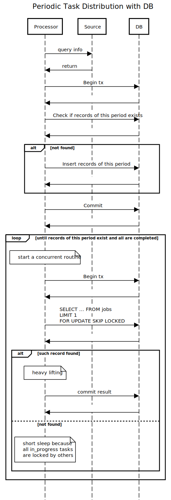

[](https://go.dev/)
# Reliable, Efficient and Idempotent Distribution of Laborious, Runtime-Error-Ridden Jobs

This project demonstrates the idea of leveraging an RDBMS (PostgreSQL here) to achieve job distribution without the use of message queues.

A more detailed explanation and motivation can be found at https://www.linkedin.com/pulse/db-mq-reliable-task-distributions-poc-jason-lui-1zmzc/. 

To see the implementation of the handling, you may just read [handle/handle.go](handle/handle.go). The rest of this repo exists only to make it runnable.

## How to run

### Prerequisites

- Go (1.22)
- Docker
- GNU make utility (optional, it only makes the commands shorter)

To run the project, use the following command
```shell
make run
```
with the default config. Check out the top part of [main.go](main.go), struct `config` for the list of environment variables.

To override some of them, run it like
```shell
SEED_SIZE=1000 make run
```

## Sequence Diagram

The project implements 
